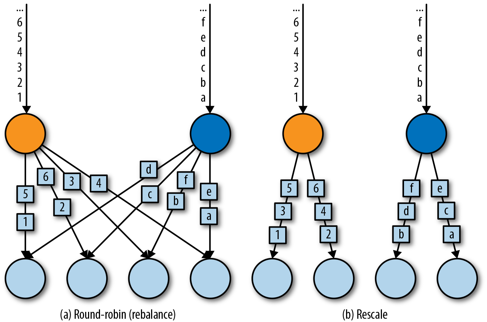

### 分布式转换算子

分区操作对应于我们之前讲过的“数据交换策略”这一节。这些操作定义了事件如何分配到不同的任务中去。当我们使用DataStream API来编写程序时，系统将自动的选择数据分区策略，然后根据操作符的语义和设置的并行度将数据路由到正确的地方去。有些时候，我们需要在应用程序的层面控制分区策略，或者自定义分区策略。例如，如果我们知道会发生数据倾斜，那么我们想要针对数据流做负载均衡，将数据流平均发送到接下来的操作符中去。又或者，应用程序的业务逻辑可能需要一个算子所有的并行任务都需要接收同样的数据。再或者，我们需要自定义分区策略的时候。在这一小节，我们将展示DataStream的一些方法，可以使我们来控制或者自定义数据分区策略。

>keyBy()方法不同于分布式转换算子。所有的分布式转换算子将产生DataStream数据类型。而keyBy()产生的类型是KeyedStream，它拥有自己的keyed state。

*Random*

随机数据交换由`DataStream.shuffle()`方法实现。shuffle方法将数据随机的分配到下游算子的并行任务中去。

*Round-Robin*

`rebalance()`方法使用Round-Robin负载均衡算法将输入流平均分配到随后的并行运行的任务中去。图5-7为round-robin分布式转换算子的示意图。

*Rescale*

`rescale()`方法使用的也是round-robin算法，但只会将数据发送到接下来的并行运行的任务中的一部分任务中。本质上，当发送者任务数量和接收者任务数量不一样时，rescale分区策略提供了一种轻量级的负载均衡策略。如果接收者任务的数量是发送者任务的数量的倍数时，rescale操作将会效率更高。

`rebalance()`和`rescale()`的根本区别在于任务之间连接的机制不同。 `rebalance()`将会针对所有发送者任务和所有接收者任务之间建立通信通道，而`rescale()`仅仅针对每一个任务和下游算子的一部分子并行任务之间建立通信通道。rescale的示意图为图5-7。



*Broadcast*

`broadcast()`方法将输入流的所有数据复制并发送到下游算子的所有并行任务中去。

*Global*

`global()`方法将所有的输入流数据都发送到下游算子的第一个并行任务中去。这个操作需要很谨慎，因为将所有数据发送到同一个task，将会对应用程序造成很大的压力。

*Custom*

当Flink提供的分区策略都不适用时，我们可以使用`partitionCustom()`方法来自定义分区策略。这个方法接收一个`Partitioner`对象，这个对象需要实现分区逻辑以及定义针对流的哪一个字段或者key来进行分区。下面的例子将一条整数流做partition，使得所有的负整数都发送到第一个任务中，剩下的数随机分配。

```scala
val numbers: DataStream[(Int)] = ...
numbers.partitionCustom(myPartitioner, 0)

object myPartitioner extends Partitioner[Int] {
  val r = scala.util.Random

  override def partition(key: Int, numPartitions: Int): Int = {
    if (key < 0) 0 else r.nextInt(numPartitions)
  }
}
```

