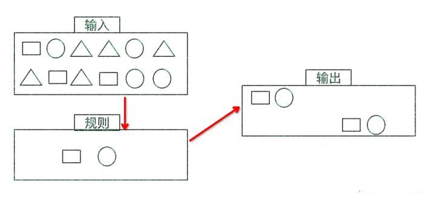
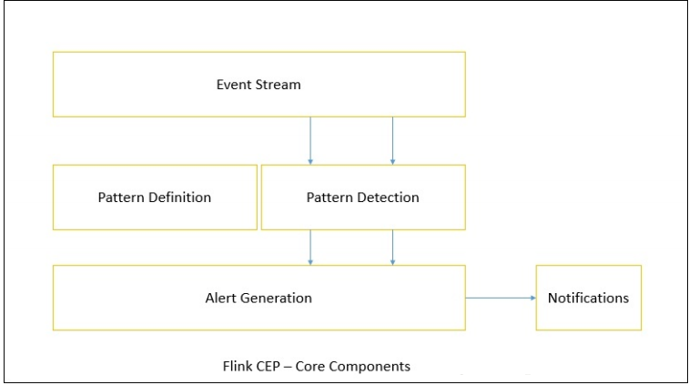

# 第十一章，Flink CEP简介

*什么是复杂事件CEP？*

一个或多个由简单事件构成的事件流通过一定的规则匹配，然后输出用户想得到的数据，满足规则的复杂事件。

*特征：*

* 目标：从有序的简单事件流中发现一些高阶特征
* 输入：一个或多个由简单事件构成的事件流
* 处理：识别简单事件之间的内在联系，多个符合一定规则的简单事件构成复杂事件
* 输出：满足规则的复杂事件



CEP用于分析低延迟、频繁产生的不同来源的事件流。CEP可以帮助在复杂的、不相关的事件流中找出有意义的模式和复杂的关系，以接近实时或准实时的获得通知并阻止一些行为。

CEP支持在流上进行模式匹配，根据模式的条件不同，分为连续的条件或不连续的条件；模式的条件允许有时间的限制，当在条件范围内没有达到满足的条件时，会导致模式匹配超时。

看起来很简单，但是它有很多不同的功能：

* 输入的流数据，尽快产生结果
* 在2个event流上，基于时间进行聚合类的计算
* 提供实时/准实时的警告和通知
* 在多样的数据源中产生关联并分析模式
* 高吞吐、低延迟的处理

市场上有多种CEP的解决方案，例如Spark、Samza、Beam等，但他们都没有提供专门的library支持。但是Flink提供了专门的CEP library。

*Flink CEP*

Flink为CEP提供了专门的Flink CEP library，它包含如下组件：

* Event Stream
* pattern定义
* pattern检测
* 生成Alert



首先，开发人员要在DataStream流上定义出模式条件，之后Flink CEP引擎进行模式检测，必要时生成告警。

为了使用Flink CEP，我们需要导入依赖：

```xml
<dependency>
  <groupId>org.apache.flink</groupId>
  <artifactId>flink-cep-scala_${scala.binary.version}</artifactId>
  <version>${flink.version}</version>
</dependency>
```

*Event Streams*

登录事件流

```scala
case class LoginEvent(userId: String,
                      ip: String,
                      eventType: String,
                      eventTime: String)

val env = StreamExecutionEnvironment.getExecutionEnvironment
env.setStreamTimeCharacteristic(TimeCharacteristic.EventTime)
env.setParallelism(1)

val loginEventStream = env
  .fromCollection(List(
    LoginEvent("1", "192.168.0.1", "fail", "1558430842"),
    LoginEvent("1", "192.168.0.2", "fail", "1558430843"),
    LoginEvent("1", "192.168.0.3", "fail", "1558430844"),
    LoginEvent("2", "192.168.10.10", "success", "1558430845")
  ))
  .assignAscendingTimestamps(_.eventTime.toLong * 1000)
```

*Pattern API*

每个Pattern都应该包含几个步骤，或者叫做state。从一个state到另一个state，通常我们需要定义一些条件，例如下列的代码：

```scala
val loginFailPattern = Pattern.begin[LoginEvent]("begin")
  .where(_.eventType.equals("fail"))
  .next("next")
  .where(_.eventType.equals("fail"))
  .within(Time.seconds(10)
```

每个state都应该有一个标示：

例如: `.begin[LoginEvent]("begin")`中的"begin"

每个state都需要有一个唯一的名字，而且需要一个filter来过滤条件，这个过滤条件定义事件需要符合的条件

例如: `.where(_.eventType.equals("fail"))`

我们也可以通过subtype来限制event的子类型：

```scala
start.subtype(SubEvent.class).where(...);
```

事实上，你可以多次调用subtype和where方法；而且如果where条件是不相关的，你可以通过or来指定一个单独的filter函数：

```scala
pattern.where(...).or(...);
```

之后，我们可以在此条件基础上，通过next或者followedBy方法切换到下一个state，next的意思是说上一步符合条件的元素之后紧挨着的元素；而followedBy并不要求一定是挨着的元素。这两者分别称为严格近邻和非严格近邻。

```scala
val strictNext = start.next("middle")
val nonStrictNext = start.followedBy("middle")
```

最后，我们可以将所有的Pattern的条件限定在一定的时间范围内：

```scala
next.within(Time.seconds(10))
```

这个时间可以是Processing Time，也可以是Event Time。

*Pattern 检测*

通过一个input DataStream以及刚刚我们定义的Pattern，我们可以创建一个PatternStream：

```scala
val input = ...
val pattern = ...

val patternStream = CEP.pattern(input, pattern)
```

```scala
val patternStream = CEP
  .pattern(
    loginEventStream.keyBy(_.userId), loginFailPattern
  )
```

一旦获得PatternStream，我们就可以通过select或flatSelect，从一个Map序列找到我们需要的告警信息。

*select*

select方法需要实现一个PatternSelectFunction，通过select方法来输出需要的警告。它接受一个Map对，包含string/event，其中key为state的名字，event则为真是的Event。

```scala
val loginFailDataStream = patternStream
  .select((pattern: Map[String, Iterable[LoginEvent]]) => {
    val first = pattern.getOrElse("begin", null).iterator.next()
    val second = pattern.getOrElse("next", null).iterator.next()

    (second.userId, second.ip, second.eventType)
  })
```

其返回值仅为1条记录。

*flatSelect*

通过实现PatternFlatSelectFunction，实现与select相似的功能。唯一的区别就是flatSelect方法可以返回多条记录。

*超时事件的处理*

通过within方法，我们的parttern规则限定在一定的窗口范围内。当有超过窗口时间后还到达的event，我们可以通过在select或flatSelect中，实现PatternTimeoutFunction/PatternFlatTimeoutFunction来处理这种情况。

```scala
val complexResult = patternStream.select(orderTimeoutOutput) {
  (pattern: Map[String, Iterable[OrderEvent]], timestamp: Long) => {
    val createOrder = pattern.get("begin")
    OrderTimeoutEvent(createOrder.get.iterator.next().orderId, "timeout")
  }
} {
  pattern: Map[String, Iterable[OrderEvent]] => {
    val payOrder = pattern.get("next")
    OrderTimeoutEvent(payOrder.get.iterator.next().orderId, "success")
  }
}

val timeoutResult = complexResult.getSideOutput(orderTimeoutOutput)

complexResult.print()
timeoutResult.print()
```

完整例子:

```scala
import org.apache.flink.cep.scala.CEP
import org.apache.flink.cep.scala.pattern.Pattern
import org.apache.flink.streaming.api.TimeCharacteristic
import org.apache.flink.streaming.api.scala._
import org.apache.flink.streaming.api.windowing.time.Time

import scala.collection.Map

object ScalaFlinkLoginFail {

  def main(args: Array[String]): Unit = {

    val env = StreamExecutionEnvironment.getExecutionEnvironment
    env.setStreamTimeCharacteristic(TimeCharacteristic.EventTime)
    env.setParallelism(1)

    val loginEventStream = env.fromCollection(List(
      LoginEvent("1", "192.168.0.1", "fail", "1558430842"),
      LoginEvent("1", "192.168.0.2", "fail", "1558430843"),
      LoginEvent("1", "192.168.0.3", "fail", "1558430844"),
      LoginEvent("2", "192.168.10.10", "success", "1558430845")
    )).assignAscendingTimestamps(_.eventTime.toLong)

    val loginFailPattern = Pattern.begin[LoginEvent]("begin")
      .where(_.eventType.equals("fail"))
      .next("next")
      .where(_.eventType.equals("fail"))
      .within(Time.seconds(10))

    val patternStream = CEP.pattern(
      loginEventStream.keyBy(_.userId), loginFailPattern
    )

    val loginFailDataStream = patternStream
      .select((pattern: Map[String, Iterable[LoginEvent]]) => {
        val first = pattern.getOrElse("begin", null).iterator.next()
        val second = pattern.getOrElse("next", null).iterator.next()

        (second.userId, second.ip, second.eventType)
      })

    loginFailDataStream.print

    env.execute
  }

}

case class LoginEvent(userId: String,
                      ip: String,
                      eventType: String,
                      eventTime: String)
```

